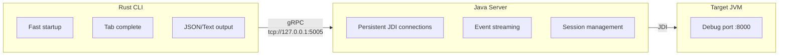

# JDBG - Scriptable Java Debugger

[](https://github.com/your-org/jdbg/actions/workflows/integration-tests.yml)
[](https://codecov.io/gh/your-org/jdbg)

A **non-interactive, scriptable Java debugger CLI** designed for automation, CI/CD pipelines, and IDE integrations.

Unlike `jdb` which requires a REPL-based interaction, JDBG exposes each debugger operation as a standalone CLI command.

## Features

- **One command = one action** - No interactive sessions required
- **Machine-readable output** - JSON output for scripting and automation
- **Persistent sessions** - Server maintains JDI connections across CLI invocations
- **Shell completions** - Tab completion for commands, options, and dynamic values
- **Fast CLI** - Rust-based CLI with instant startup (~3MB)
- **Server lifecycle management** - Start/stop server directly from CLI

## Architecture



## Project Structure

```
jdbg/
├── cli/              # Rust CLI client
├── server/           # Java gRPC server
├── proto/            # Shared protobuf definitions
├── doc/              # Documentation (mdBook)
├── scripts/          # Build and install scripts
└── README.md
```

## Quick Start

### Prerequisites

- Java 17+ (for the server)
- Rust toolchain (for building CLI from source)
- A target JVM with debugging enabled:
  ```bash
  java -agentlib:jdwp=transport=dt_socket,server=y,suspend=n,address=*:8000 -jar app.jar
  ```

### Installation

```bash
# Clone the repository
git clone https://github.com/your-org/jdbg.git
cd jdbg

# Build and install (to ~/.local)
./scripts/install.sh

# Or build only
./scripts/build-all.sh
```

### Usage

```bash
# Start the JDBG server
jdbg server start

# Attach to a remote JVM
jdbg session attach --host localhost --port 8000

# List threads
jdbg thread list

# Add a breakpoint
jdbg bp add --class com.example.MyClass --line 42

# Suspend and inspect
jdbg exec suspend
jdbg frame list
jdbg var list

# Resume execution
jdbg exec continue

# Get JSON output for scripting
jdbg -f json thread list | jq '.data[].name'

# Stop the server when done
jdbg server stop
```

## Commands

| Category | Commands |
|----------|----------|
| **Server** | `server start`, `server stop`, `server status` |
| **Session** | `session attach`, `session attach-pid`, `session detach`, `session list`, `session status`, `session select` |
| **Breakpoints** | `bp add`, `bp remove`, `bp list`, `bp enable`, `bp disable`, `bp clear` |
| **Execution** | `exec continue`, `exec suspend`, `exec resume`, `exec step` |
| **Threads** | `thread list`, `thread select`, `thread suspend`, `thread resume` |
| **Frames** | `frame list`, `frame select`, `frame info` |
| **Variables** | `var list`, `var get`, `var set` |
| **Evaluation** | `eval <expression>` |
| **Exceptions** | `exception catch`, `exception ignore`, `exception list` |

Use `jdbg --help` or `jdbg <command> --help` for detailed usage.

## Shell Completions

```bash
# Bash
jdbg completions bash > ~/.local/share/bash-completion/completions/jdbg

# Zsh
jdbg completions zsh > ~/.zfunc/_jdbg

# Fish
jdbg completions fish > ~/.config/fish/completions/jdbg.fish
```

## Building from Source

### Build everything

```bash
./scripts/build-all.sh
```

### Build components individually

```bash
# CLI (Rust)
cd cli && cargo build --release

# Server (Java)
cd server && ./mvnw package -DskipTests
```

### Build documentation

```bash
./scripts/build-docs.sh
# Or to serve locally:
cd doc && mdbook serve --open
```

## Environment Variables

| Variable | Description | Default |
|----------|-------------|---------|
| `JDBG_SERVER` | Server address | `tcp://127.0.0.1:5005` |
| `JDBG_SERVER_JAR` | Path to server JAR | Auto-detected |
| `JAVA_HOME` | Java installation | Auto-detected |

## Files

| File | Location | Description |
|------|----------|-------------|
| Server JAR | `~/.local/share/jdbg/jdbg-server.jar` | Server component |
| Server log | `~/.local/share/jdbg/server.log` | Server output |
| PID file | `$XDG_RUNTIME_DIR/jdbg-server.pid` | Server process ID |

## Non-Goals

JDBG is **not**:

- A replacement for IDE debuggers (IntelliJ, Eclipse, VSCode)
- An interactive REPL debugger (use `jdb` for that)
- A remote debugging protocol implementation

## License

MIT
