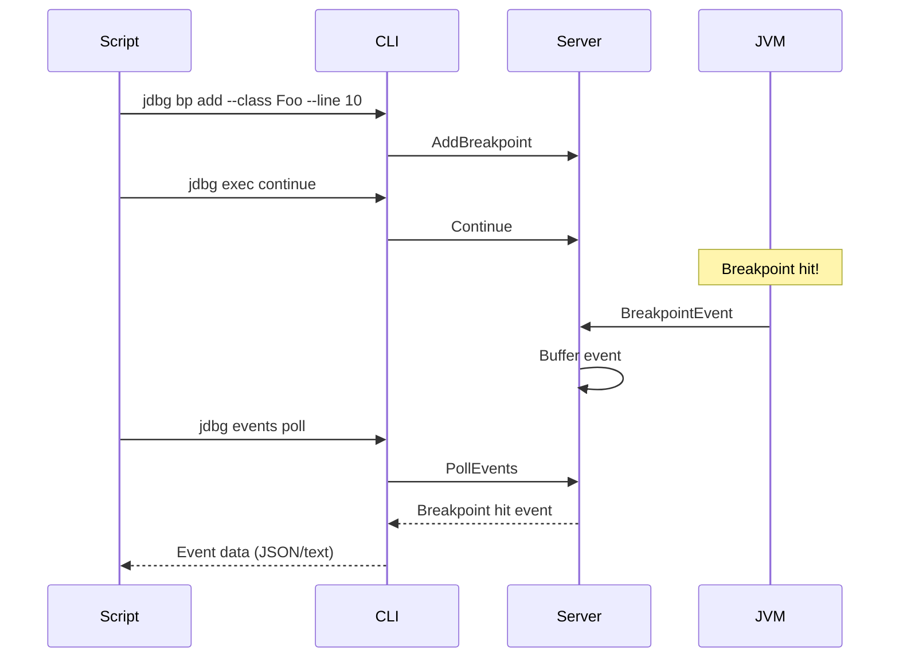

# Events

Manage and retrieve debug events (breakpoint hits, exceptions, step completions, etc.).

## Non-Blocking Event Retrieval

JDBG uses an event buffer for scriptable, non-blocking event handling. Events are stored on the server and can be polled at any time.



## Commands

### `jdbg events poll`

Poll for events without blocking. Returns immediately with any buffered events.

```bash
jdbg events poll [OPTIONS]
```

**Options:**
- `-n, --limit <N>` - Maximum events to return (0 = all buffered, default: 0)
- `-t, --types <TYPE>` - Filter by event types (can be repeated)
- `-s, --session <ID>` - Session ID

**Event types:**
- `breakpoint` - Breakpoint hit
- `step` - Step completed
- `exception` - Exception thrown
- `thread_start` - Thread started
- `thread_death` - Thread died
- `vm_death` - JVM terminated
- `vm_disconnect` - Connection lost

**Examples:**
```bash
# Get all buffered events
jdbg events poll

# Get only breakpoint events
jdbg events poll -t breakpoint

# Get at most 5 events
jdbg events poll -n 5

# Get breakpoint and exception events
jdbg events poll -t breakpoint -t exception

# JSON output for scripting
jdbg -f json events poll | jq '.events[] | {type: .event_type, thread: .breakpoint_hit.location.thread_name}'
```

### `jdbg events wait`

Wait for the next event. Blocks until an event occurs or timeout.

```bash
jdbg events wait [OPTIONS]
```

**Options:**
- `--timeout <MS>` - Timeout in milliseconds (0 = default 30s)
- `-t, --types <TYPE>` - Filter by event types
- `-s, --session <ID>` - Session ID

**Examples:**
```bash
# Wait for any event (default 30s timeout)
jdbg events wait

# Wait up to 5 seconds for a breakpoint event
jdbg events wait --timeout 5000 -t breakpoint

# Wait for exception or breakpoint
jdbg events wait -t exception -t breakpoint
```

### `jdbg events clear`

Clear all buffered events.

```bash
jdbg events clear [OPTIONS]
```

**Options:**
- `-s, --session <ID>` - Session ID

### `jdbg events info`

Get information about the event buffer.

```bash
jdbg events info [OPTIONS]
```

**Options:**
- `-s, --session <ID>` - Session ID

**Example output:**
```
Buffered events: 3
Buffer capacity: 1000
Oldest event: 5234ms ago
Newest event: 102ms ago
```

### `jdbg events subscribe`

Subscribe to real-time event streaming. Blocks indefinitely, printing events as they occur.

```bash
jdbg events subscribe [OPTIONS]
```

**Options:**
- `-s, --session <ID>` - Session ID

**Use cases:**
- Real-time monitoring in a separate terminal
- Interactive debugging sessions
- Continuous event logging

**Example:**
```bash
# In one terminal, subscribe to events
jdbg events subscribe

# In another terminal, control execution
jdbg exec continue
jdbg exec step
```

For non-interactive scripting, `poll` and `wait` are usually more suitable as they allow synchronous control flow.

## Scripting Patterns

### Wait for breakpoint and inspect

```bash
#!/bin/bash
# Start debugging
jdbg server start
jdbg session attach --host localhost --port 8000

# Set breakpoint
jdbg bp add --class com.example.Main --method process

# Resume and wait for breakpoint
jdbg exec continue
if jdbg events wait --timeout 10000 -t breakpoint; then
    echo "Breakpoint hit!"
    jdbg frame list
    jdbg var list
fi
```

### Poll in a loop

```bash
#!/bin/bash
# Resume execution
jdbg exec continue

# Poll every second until we get an event
while true; do
    events=$(jdbg -f json events poll)
    count=$(echo "$events" | jq '.events | length')
    
    if [ "$count" -gt 0 ]; then
        echo "$events" | jq -r '.events[] | "\(.event_type): \(.breakpoint_hit.location.class_name // ""):\(.breakpoint_hit.location.line_number // "")"'
        break
    fi
    
    sleep 1
done
```

### Event-driven debugging

```bash
#!/bin/bash
# Clear any old events
jdbg events clear

# Set breakpoints
jdbg bp add --class com.example.Service --line 42
jdbg exception catch java.lang.NullPointerException

# Continue execution
jdbg exec continue

# Process events as they occur
while true; do
    event=$(jdbg -f json events wait --timeout 60000)
    
    if [ -z "$event" ] || [ "$(echo "$event" | jq '.events | length')" -eq 0 ]; then
        echo "Timeout waiting for event"
        continue
    fi
    
    event_type=$(echo "$event" | jq -r '.events[0].event_type')
    
    case "$event_type" in
        breakpoint)
            echo "Breakpoint hit - inspecting..."
            jdbg var list
            jdbg exec step --over
            ;;
        exception)
            echo "Exception caught!"
            jdbg frame list
            break
            ;;
        vm_disconnect)
            echo "JVM disconnected"
            break
            ;;
    esac
done
```

## JSON Output

All event commands support JSON output with `-f json`:

```bash
jdbg -f json events poll
```

```json
{
  "events": [
    {
      "timestamp": 1703875234567,
      "session_id": "abc12345",
      "sequence_number": 1,
      "event_type": "breakpoint",
      "breakpoint_hit": {
        "breakpoint_id": "def67890",
        "location": {
          "thread_id": 1,
          "thread_name": "main",
          "class_name": "com.example.Main",
          "method_name": "process",
          "source_name": "Main.java",
          "line_number": 42
        }
      }
    }
  ],
  "remaining_count": 0
}
```

