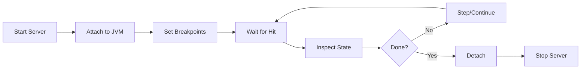

# Quick Start

This guide walks through a typical debugging session with JDBG.

## Workflow Overview



## Setup

Start with a target JVM with debugging enabled:

```bash
java -agentlib:jdwp=transport=dt_socket,server=y,suspend=n,address=*:8000 \
     -jar your-application.jar
```

## 1. Start the JDBG Server

```bash
jdbg server start
```

The server runs in the background and maintains persistent JDI connections.

## 2. Attach to the JVM

```bash
jdbg session attach --host localhost --port 8000
```

Output:
```
Session: abc12345
  Type: AttachedRemote
  State: Connected
  Host: localhost
  Port: 8000
  VM: OpenJDK 64-Bit Server VM 17.0.17
```

## 3. Set Breakpoints

```bash
# Line breakpoint
jdbg bp add --class com.example.MyService --line 42

# Method breakpoint
jdbg bp add --class com.example.MyService --method processRequest

# List breakpoints
jdbg bp list
```

## 4. Suspend and Inspect

```bash
# Suspend all threads
jdbg exec suspend

# List threads (show only suspended)
jdbg thread list --suspended-only

# Select a thread
jdbg thread select 42

# View stack trace
jdbg frame list

# Select a frame and view variables
jdbg frame select 2
jdbg var list
```

## 5. Step Through Code

```bash
# Step over (next line)
jdbg exec step --over

# Step into method
jdbg exec step --into

# Step out of method
jdbg exec step --out

# Continue execution
jdbg exec continue
```

## 6. Evaluate Expressions

```bash
# Get variable value
jdbg var get myVariable

# Evaluate expression
jdbg eval "this.field"
jdbg eval "list.size()"
```

## 7. Exception Breakpoints

```bash
# Break on NullPointerException
jdbg exception catch java.lang.NullPointerException

# Break on all exceptions
jdbg exception catch java.lang.Exception

# List exception breakpoints
jdbg exception list
```

## 8. JSON Output for Scripting

```bash
# Get thread IDs as JSON
jdbg -f json thread list | jq '.data[].id'

# Get suspended thread names
jdbg -f json thread list | jq '.data[] | select(.suspended) | .name'

# Script example
for bp in $(jdbg -f json bp list | jq -r '.data[].id'); do
    jdbg bp remove $bp
done
```

## 9. Cleanup

```bash
# Detach from session
jdbg session detach

# Stop the server
jdbg server stop
```

## Tips

- Use `--help` on any command for detailed usage
- Use `-f json` for machine-readable output
- Use `jdbg server status` to check if the server is running
- Log file is at `~/.local/share/jdbg/server.log`

