# JDBG - Scriptable Java Debugger

JDBG is a **non-interactive, scriptable Java debugger CLI** designed for automation, CI/CD pipelines, and IDE integrations. Unlike `jdb`, which requires a REPL-based interaction, JDBG exposes each debugger operation as a standalone CLI command.

## Key Features

- **One command = one action** - No interactive sessions required
- **Machine-readable output** - JSON output for scripting and automation
- **Persistent sessions** - Server maintains JDI connections across CLI invocations
- **Shell completions** - Tab completion for classes, methods, threads, variables
- **Fast CLI** - Rust-based CLI with instant startup

## Architecture

```mermaid
flowchart LR
    subgraph CLI["Rust CLI (~3MB)"]
        direction TB
        C1["⚡ Fast startup"]
        C2["🔤 Tab complete"]
        C3["📄 JSON/Text"]
    end

    subgraph Server["Java Server (~37MB)"]
        direction TB
        S1["🔗 Persistent JDI"]
        S2["📡 Event stream"]
    end

    subgraph Target["Target JVM"]
        T1[":8000"]
    end

    CLI -->|"gRPC<br/>tcp://127.0.0.1:5005"| Server
    Server -->|"JDI"| Target
```



## Quick Example

```bash
# Start the daemon server
jdbg server start

# Attach to a remote JVM
jdbg session attach --host localhost --port 8000

# Add a breakpoint
jdbg bp add --class com.example.MyClass --line 42

# List threads
jdbg thread list

# Get JSON output for scripting
jdbg -f json bp list | jq '.data[].id'

# Stop the server
jdbg server stop
```

## Non-Goals

JDBG is **not**:

- A replacement for IDE debuggers (IntelliJ, Eclipse, VSCode)
- An interactive REPL debugger (use `jdb` for that)
- A remote debugging protocol (it uses JDI internally)

