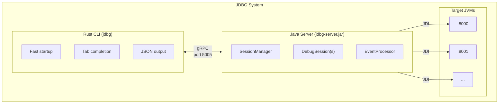
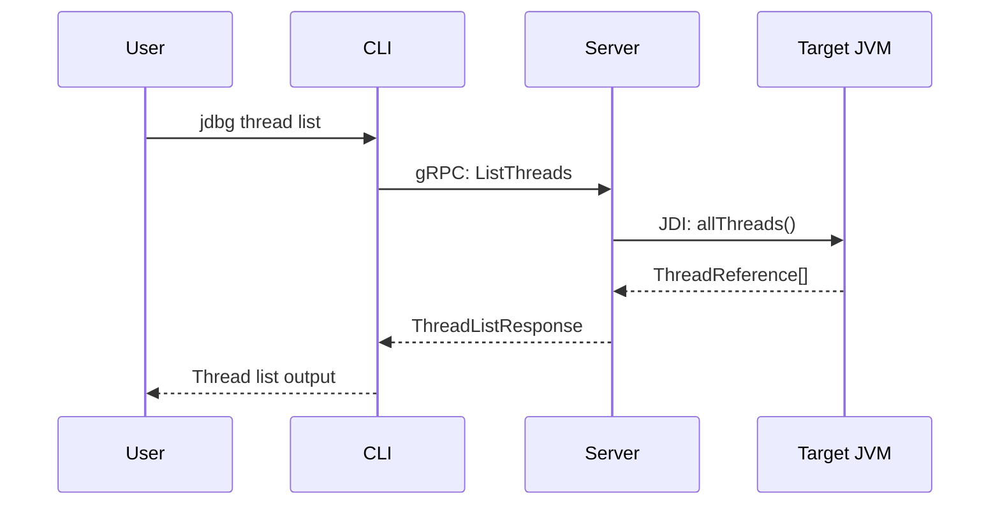
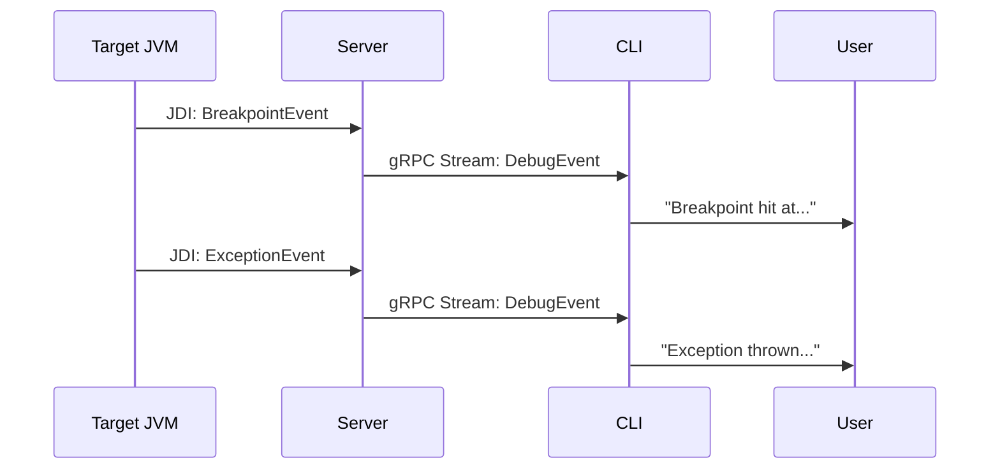
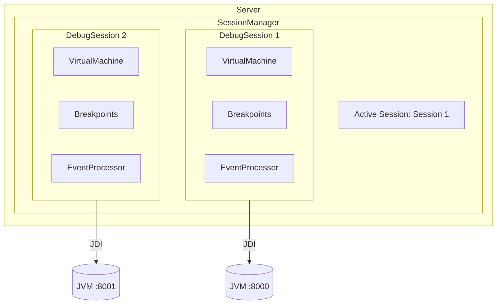

# Architecture

JDBG uses a client-server architecture to provide persistent debugging sessions.

## Overview

## Components

### Rust CLI (`cli/`)

The command-line interface is written in Rust for:
- **Instant startup** - No JVM warmup required
- **Shell completions** - Native support via `clap`
- **Small binary** - ~3MB statically linked

The CLI communicates with the server via gRPC and can produce both human-readable text and machine-readable JSON output.

### Java Server (`server/`)

The server component is written in Java because:
- **JDI is Java-only** - The Java Debug Interface is part of the JDK
- **Persistent connections** - Maintains JDI connections across CLI invocations
- **Event processing** - Handles breakpoint hits, exceptions, etc.

### Protocol Buffers (`proto/`)

The gRPC interface is defined in `proto/jdbg.proto` and includes:
- `DebuggerService` - Main debugging operations
- `CompletionService` - Tab completion support

## Data Flow

### Command Execution

### Event Streaming

## Session Management

## Why This Architecture?

### Problem with Direct JDI Access

JDI requires a persistent connection to the target JVM. If each CLI command created a new connection:
- Suspend state would be lost between commands
- Breakpoints would need to be re-registered
- Performance would suffer from connection overhead

### Solution: Daemon Server

By using a daemon server:
- **Persistent connections** - JDI state is maintained
- **Multiple sessions** - Debug multiple JVMs simultaneously
- **Event handling** - Background processing of JDI events
- **Fast CLI** - No JVM startup per command

