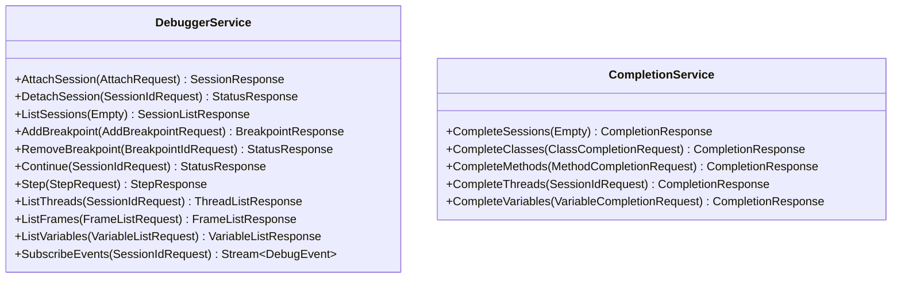

# gRPC API Reference

The JDBG server exposes two gRPC services defined in `proto/jdbg.proto`.



## Services

### DebuggerService

Main debugging operations.

| Method | Request | Response | Description |
|--------|---------|----------|-------------|
| `AttachSession` | `AttachRequest` | `SessionResponse` | Attach to a JVM |
| `LaunchSession` | `LaunchRequest` | `SessionResponse` | Launch a new JVM |
| `DetachSession` | `SessionIdRequest` | `StatusResponse` | Detach from session |
| `GetSessionStatus` | `SessionIdRequest` | `SessionResponse` | Get session info |
| `ListSessions` | `Empty` | `SessionListResponse` | List all sessions |
| `SetActiveSession` | `SessionIdRequest` | `StatusResponse` | Set active session |
| `AddBreakpoint` | `AddBreakpointRequest` | `BreakpointResponse` | Add breakpoint |
| `RemoveBreakpoint` | `BreakpointIdRequest` | `StatusResponse` | Remove breakpoint |
| `ListBreakpoints` | `SessionIdRequest` | `BreakpointListResponse` | List breakpoints |
| `Continue` | `SessionIdRequest` | `StatusResponse` | Resume execution |
| `Suspend` | `SuspendRequest` | `StatusResponse` | Suspend execution |
| `Resume` | `ResumeRequest` | `StatusResponse` | Resume threads |
| `Step` | `StepRequest` | `StepResponse` | Step execution |
| `ListThreads` | `SessionIdRequest` | `ThreadListResponse` | List threads |
| `SelectThread` | `SelectThreadRequest` | `StatusResponse` | Select thread |
| `ListFrames` | `FrameListRequest` | `FrameListResponse` | List stack frames |
| `SelectFrame` | `SelectFrameRequest` | `StatusResponse` | Select frame |
| `ListVariables` | `VariableListRequest` | `VariableListResponse` | List variables |
| `GetVariable` | `GetVariableRequest` | `VariableResponse` | Get variable |
| `SetVariable` | `SetVariableRequest` | `StatusResponse` | Set variable |
| `Evaluate` | `EvaluateRequest` | `EvaluateResponse` | Evaluate expression |
| `SubscribeEvents` | `SessionIdRequest` | `stream DebugEvent` | Event stream |

### CompletionService

Tab completion support.

| Method | Request | Response | Description |
|--------|---------|----------|-------------|
| `CompleteSessions` | `Empty` | `CompletionResponse` | Complete session IDs |
| `CompleteClasses` | `ClassCompletionRequest` | `CompletionResponse` | Complete class names |
| `CompleteMethods` | `MethodCompletionRequest` | `CompletionResponse` | Complete method names |
| `CompleteThreads` | `SessionIdRequest` | `CompletionResponse` | Complete thread IDs |
| `CompleteVariables` | `VariableCompletionRequest` | `CompletionResponse` | Complete variable names |
| `CompleteBreakpoints` | `SessionIdRequest` | `CompletionResponse` | Complete breakpoint IDs |

## Events

The `SubscribeEvents` method returns a stream of `DebugEvent` messages:

| Event Type | Description |
|------------|-------------|
| `BreakpointHitEvent` | Breakpoint was hit |
| `StepCompletedEvent` | Step completed |
| `ExceptionEvent` | Exception thrown |
| `ThreadStartEvent` | Thread started |
| `ThreadDeathEvent` | Thread died |
| `VmDeathEvent` | JVM terminated |
| `VmDisconnectEvent` | Connection lost |

## Connection

Default address: `tcp://127.0.0.1:5005`

Environment variable: `JDBG_SERVER`

## Example: Using grpcurl

```bash
# List sessions
grpcurl -plaintext localhost:5005 jdbg.DebuggerService/ListSessions

# Attach to JVM
grpcurl -plaintext -d '{"remote": {"host": "localhost", "port": 8000}}' \
    localhost:5005 jdbg.DebuggerService/AttachSession
```

